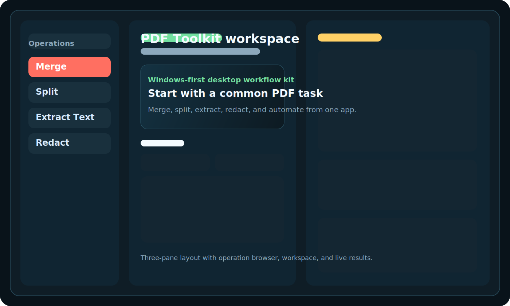
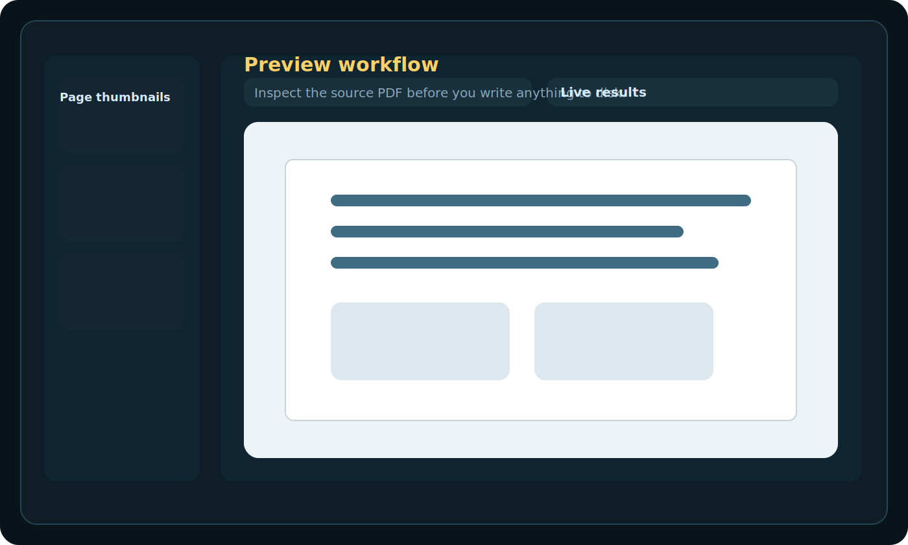
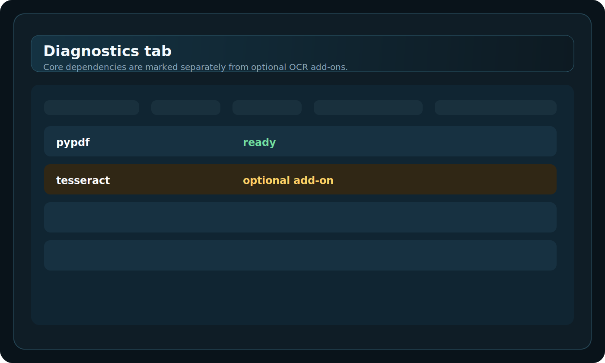
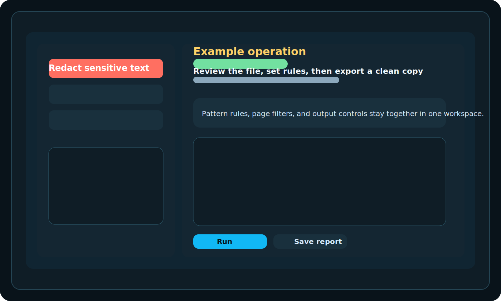

# PDF Toolkit

<p align="center">
  
</p>

<p align="center">
  Practical Windows-first PDF workflows for office teams, admin work, and repeatable desktop document cleanup.
</p>

<p align="center">
  <a href="https://github.com/JeffScripts/pdf-toolkit/releases">Download for Windows</a> |
  <a href="docs/run-from-source.md">Run from source</a> |
  <a href="docs/enabling-ocr.md">Enable OCR later</a>
</p>

## Why this exists

PDF Toolkit wraps the document tasks people actually repeat all week into one desktop app:

- merge and split packets
- preview and inspect PDFs before changing them
- extract text, images, attachments, and tables
- redact sensitive text and regions
- fill forms, update metadata, and automate batch workflows

It is built for Windows first and optimized for people who want a portable app, not a Python project setup.

## Best for

| Workflow | Why PDF Toolkit fits |
| --- | --- |
| Office admins | Fast merge, split, rotate, crop, number, and metadata cleanup |
| Operations teams | Batch manifests, watch folders, repeatable output paths |
| Compliance work | Redaction tools, extraction, diagnostics, and audit-style outputs |
| Power users | Deep PDF operations without bouncing between multiple utilities |

## 2-minute start

1. Open the latest [GitHub Release](https://github.com/JeffScripts/pdf-toolkit/releases).
2. Download `pdf-toolkit-windows-x64.zip`.
3. Extract the ZIP to a normal folder such as `Documents\PDF Toolkit`.
4. Run `pdf-toolkit-gui.exe`.
5. Start with `Merge`, `Split`, `Extract Text`, or `Redact`.

Windows packaged app is the recommended install path for the first public release.

## What works immediately

- Merge, split, rotate, crop, render, and page numbering
- Preview and inspect PDF contents before exporting
- Text extraction, image extraction, attachments, forms, bookmarks, and metadata tools
- Table export to CSV, XLSX, and JSON
- Batch jobs, watch folders, and duplicate-file cleanup

## OCR note

OCR is intentionally optional in the first public release.

Core PDF workflows work out of the box. If you want OCR, install or bundle:

- `ocrmypdf`
- `tesseract`
- Ghostscript (`gswin64c.exe`)

Details: [docs/enabling-ocr.md](docs/enabling-ocr.md)

## Preview

### Main workspace



### PDF preview workflow



### Diagnostics and readiness



### Example operation flow



## Sample workflows

### Merge monthly invoice PDFs

- Choose `Merge`
- Add the invoice PDFs
- Set one output file
- Run and verify the combined preview

### Redact PII before sharing

- Choose `Redact`
- Enter patterns or boxes
- Export a clean copy to a separate file

### Export tables for spreadsheets

- Choose `Tables Extract`
- Select CSV, XLSX, JSON, or All
- Save into a dedicated output folder

### Watch a folder for new documents

- Build a manifest
- Use `Watch Folder`
- Let the app process new PDFs as they arrive

More examples: [docs/sample-workflows.md](docs/sample-workflows.md)

## Install options

### Recommended: portable Windows app

Follow [docs/install-windows.md](docs/install-windows.md).

### Source install

```powershell
python -m venv .venv
.\.venv\Scripts\Activate.ps1
python -m pip install -U pip
python -m pip install -e .[dev]
python -m pdf_toolkit
```

You can also use:

```powershell
.\run_pdf_toolkit.bat
```

## Build the packaged app

```powershell
powershell -ExecutionPolicy Bypass -File scripts\build_gui.ps1
```

To produce release artifacts locally:

```powershell
powershell -ExecutionPolicy Bypass -File scripts\package_release.ps1
```

## Support stance

- Windows is the supported platform for the first public release.
- The packaged app is the recommended install path.
- OCR is optional and may require extra local tools.
- Source install remains available for developers and advanced users.

## Troubleshooting

- Packaged app will not start: [docs/troubleshooting.md](docs/troubleshooting.md)
- OCR shows as missing: expected unless OCR tools were installed separately
- Source install problems: recreate `.venv` and reinstall with Python 3.11+

## Contributing

See [CONTRIBUTING.md](CONTRIBUTING.md).

## License

MIT. See [LICENSE](LICENSE).
